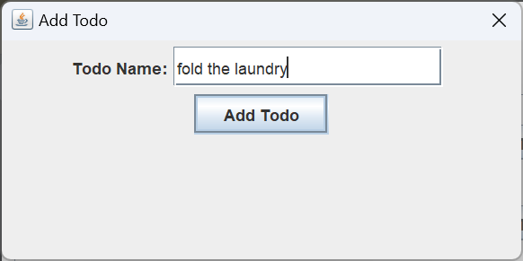

# Todo List Spring Application using Kafka and MySQL 

## Description

This is a simple Todo List Application developed as part of a school project. It allows users to create, manage, and delete tasks using a graphical user interface (GUI).

My motivation was to create a project that would give me more knowledge about the Java language and how to use it. I also wanted to learn more about Kafka, SpringBoot and MySQL.

## Table of Contents (Optional)

- [Installation](#installation)
- [Usage](#usage)
- [License](#license)

## Installation

Before you can run this application, make sure you have the following software and tools installed on your system:

* Java Development Kit (JDK) 8 or later
* Apache Kafka
* MySQL Database

1. Clone the repository to your computer and open it in IntelliJ.

2. Start zookeeper and kafka server. (if you don't have them installed, you can download them here: https://kafka.apache.org/downloads)

3. Start your MySQL server. (if you don't have it installed, you can download it here: https://dev.mysql.com/downloads/mysql/)
* Manually create a database in MySQL called "todos"!

4. Configure the application.properties file in the resources folder to match your MySQL settings (username/password).

5. Run the main class 'KafkaTodoApplication' to start the application.

## Usage

Once the application is up and running, you can use the GUI to perform the following actions:

* Load Todos from the Database: Click the "Load from DB" button to fetch and display todos stored in the database. The button will be disabled after the todos are loaded.

* Create a New Todo: Click the "New Todo" button, enter the todo name in the pop-up dialog, and click "Add Todo."

* Delete a Todo: Click the "Delete Todo" button beside the todo you want to delete.

## Dependencies
* [junit jupiter 5](https://mvnrepository.com/artifact/org.junit.jupiter/junit-jupiter/5.7.0)
* [spring-boot-starter-parent](https://mvnrepository.com/artifact/org.springframework.boot/spring-boot-starter-parent/2.4.2)
* [spring-boot-starter-data-jpa](https://mvnrepository.com/artifact/org.springframework.boot/spring-boot-starter-data-jpa/2.4.2)
* [spring-boot-starter-jdbc](https://mvnrepository.com/artifact/org.springframework.boot/spring-boot-starter-jdbc/2.4.2)
* [spring-boot-starter-web](https://mvnrepository.com/artifact/org.springframework.boot/spring-boot-starter-web/2.4.2)
* [spring-boot-starter-test](https://mvnrepository.com/artifact/org.springframework.boot/spring-boot-starter-test/2.4.2)
* [spring-kafka](https://mvnrepository.com/artifact/org.springframework.kafka/spring-kafka/2.6.6)
* [spring-kafka-test](https://mvnrepository.com/artifact/org.springframework.kafka/spring-kafka-test/2.6.6)
* [mysql-connector-java](https://mvnrepository.com/artifact/mysql/mysql-connector-java/8.0.23)
* [lombok](https://mvnrepository.com/artifact/org.projectlombok/lombok/1.18.18)
* [json-simple](https://mvnrepository.com/artifact/com.googlecode.json-simple/json-simple/1.1.1)
* [httpclient5](https://mvnrepository.com/artifact/org.apache.httpcomponents.client5/httpclient5)
* [commons-text](https://mvnrepository.com/artifact/org.apache.commons/commons-text/1.10.0)

For setting up Kafka with Spring Boot, I followed this playlist of tutorials:
* [Java Guides - Spring Boot + Apache Kafka Tutorial (Playlist)](https://www.youtube.com/playlist?list=PLGRDMO4rOGcNLwoack4ZiTyewUcF6y6BU)
## License

This project is licensed under the MIT License - for more information please follow this link [MIT License](https://choosealicense.com/licenses/mit/).

---

## Badges

## How to Contribute

Contributions and suggestions are welcome! To report bugs, make suggestions or contribute to the code refer to the instructions below:

1. Fork this repository
2. Create your own branch from main
3. Add your contributions (code or documentation)
4. Commit and push
5. Wait for pull request to be merged

Alternatively, if you find a bug or have a suggestion, you can open an issue.

## Tests

There are two test classes in this project, one for the Kafka communication and one for the MySQL communication. These tests can be run by right-clicking on the test class and selecting "Run 'TestClassName'".